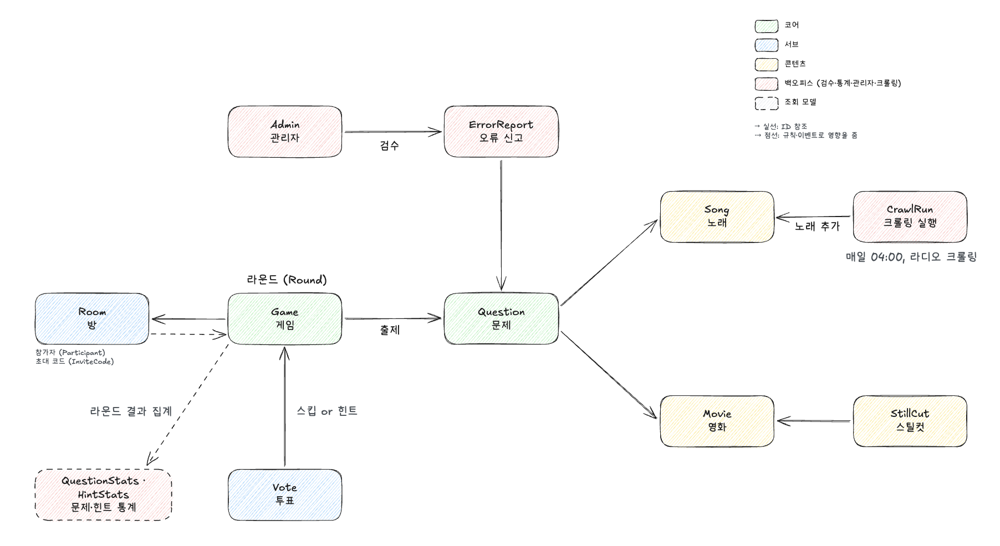

# naquiz

지인끼리 초대 코드로 방에 모여 **실시간 채팅으로 먼저 정답을 치는** 멀티플레이 퀴즈 게임입니다.

## 소개

- 게임 종류: 노래 맞추기, 영화 스무고개, 스틸컷 보고 영화 맞추기
- 로그인 없이 게스트로 입장하고, 방을 만들면 6자리 초대 코드가 생깁니다(최대 10명).
- 채팅으로 먼저 정답을 맞힌 사람이 1점을 얻고, 방장이 정한 목표 점수(최대 50점)에 먼저 도달하면 이깁니다.
- 힌트와 스킵은 참가자 투표로 정합니다.

자세한 규칙은 [기획](docs/기획.md)에 있습니다.

## 도메인



- **코어**: 게임(Game)이 라운드마다 문제(Question)를 출제하고, 문제는 노래(Song)나 영화(Movie)를 가리킵니다.
- **서브**: 방(Room)은 참가자와 초대 코드를 가지고, 투표(Vote)로 스킵이나 힌트를 엽니다.
- **콘텐츠**: 노래, 영화, 영화의 스틸컷(StillCut)
- **백오피스**: 관리자(Admin)가 오류 신고(ErrorReport)를 검수하고, 크롤링 실행(CrawlRun)이 매일 04:00 라디오 선곡표에서 노래를 추가합니다. 라운드 결과는 문제·힌트 통계로 집계됩니다.

용어와 규칙은 [DOMAIN.md](docs/DOMAIN.md)에 있습니다.

## 기술 스택

- Java 25, Spring Boot 4, Gradle 멀티모듈
- Spring Data JPA
- H2(로컬·테스트), MySQL 8(`local-dev` 프로필, docker-compose)

## 프로젝트 디렉터리

```
core/                 게임 서버 (Spring Boot, Gradle 멀티모듈)
├── core-domain/      엔티티·저장소·도메인 로직, 공통 예외·이벤트
├── game-api/         게임·방·투표 API
├── admin-api/        백오피스 API
├── crawler-batch/    데일리 크롤링
└── docs/             서버 코드 컨벤션
front/                프론트엔드 (npm workspaces)
├── apps/game/        게임 앱
├── apps/admin/       백오피스 앱
├── packages/ui/      디자인 토큰·공용 컴포넌트
└── packages/shared/  도메인 타입, 정답 판정·마스킹·투표 순수 함수
initial_crawler/      초기 노래·영화 데이터 크롤러
docs/                 기획·도메인·API 문서, 개발일지, 트러블슈팅
.claude/              Claude Code 팀 공용 스킬·에이전트·훅
```

## 문서

- [기획](docs/기획.md): 게임 종류, 룰, 힌트·투표, 백오피스
- [도메인](docs/DOMAIN.md): 유비쿼터스 언어, 애그리거트, 정답 판정·마스킹·투표 규칙
- [API](docs/API.md): HTTP API 규격
- [서버 컨벤션](core/docs/): 아키텍처, 코드 스타일, 예외, 로그, 테스트
- [Claude Code 사용법](.claude/README.md): 팀 공용 스킬·에이전트·훅
